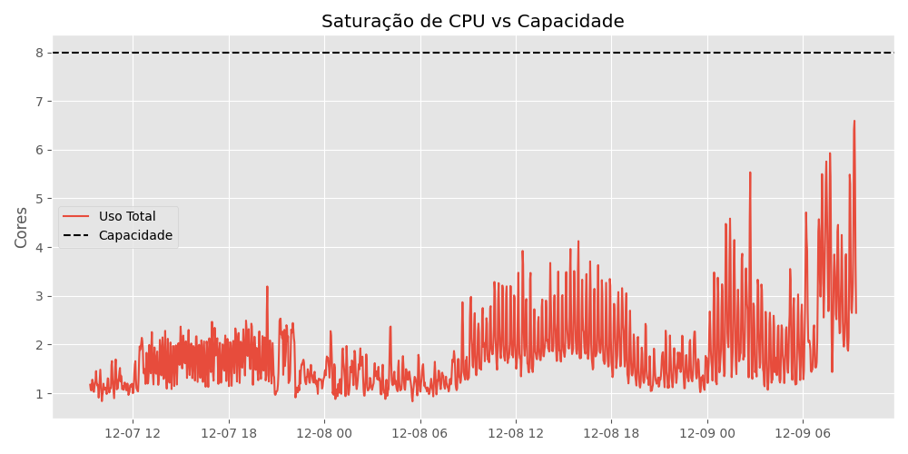
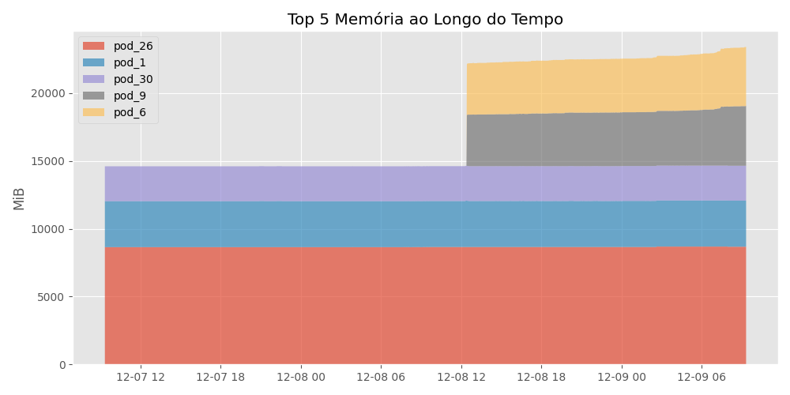

# Relatório Técnico de Performance do Prefect

**Data da Análise:** 09/12/2025 10:44
**Janela de Dados:** 2025-12-07 09:20:00 até 2025-12-09 09:20:00

## 1. Resumo Executivo

| Métrica | Valor Atual (Pico) | Capacidade Total | Saturação | Status |
| :--- | :--- | :--- | :--- | :--- |
| **CPU** | 6.59 Cores | 8.0 Cores | **82.4%** | 🔴 CRÍTICO |
| **Memória** | 34.27 GiB | 61.80 GiB | **55.5%** | 🟢 OK |

### Diagnóstico Automático
- 🚨 **Risco de Throttling:** A CPU atingiu níveis críticos. Serviços podem sofrer lentidão.
- ⚠️ **Instabilidade:** Foram detectados 5 serviços com comportamento 'explosivo' (Pico > 4x Média).

---

## 2. Análise de CPU

O gráfico abaixo demonstra o consumo total do cluster em relação à capacidade física do nó.

### Top 10 Consumidores (Cores)

| Serviço | Média | Pico | Instabilidade (Burst) |
| :--- | :--- | :--- | :--- |
| `pod_57...` | 0.258 | 0.372 | 1.4x  |
| `pod_26...` | 0.190 | 0.565 | 3.0x  |
| `pod_44...` | 0.166 | 0.498 | 3.0x  |
| `pod_9...` | 0.156 | 1.990 | 12.7x 🔴 |
| `pod_6...` | 0.152 | 1.980 | 13.0x 🔴 |
| `pod_29...` | 0.123 | 0.165 | 1.3x  |
| `pod_18...` | 0.080 | 0.959 | 12.0x 🔴 |
| `pod_27...` | 0.071 | 0.195 | 2.7x  |
| `pod_53...` | 0.060 | 0.388 | 6.4x 🔴 |
| `pod_54...` | 0.060 | 0.378 | 6.3x 🔴 |

> **Nota:** Serviços com alta instabilidade (🔴) são os principais candidatos a causar lentidão repentina no nó.

---

## 3. Análise de Memória

Visualização dos maiores consumidores de memória ao longo do tempo.

### Top 10 Consumidores

| Serviço | Média | Pico | P95 |
| :--- | :--- | :--- | :--- |
| `pod_26...` | 8.45 GiB | 8.50 GiB | 8.48 GiB |
| `pod_1...` | 3.31 GiB | 3.34 GiB | 3.32 GiB |
| `pod_30...` | 2.51 GiB | 2.51 GiB | 2.51 GiB |
| `pod_9...` | 1.70 GiB | 4.30 GiB | 4.05 GiB |
| `pod_6...` | 1.69 GiB | 4.25 GiB | 4.05 GiB |
| `pod_23...` | 1.24 GiB | 1.26 GiB | 1.26 GiB |
| `pod_10...` | 1.17 GiB | 5.09 GiB | 5.08 GiB |
| `pod_12...` | 1.11 GiB | 4.47 GiB | 4.46 GiB |
| `pod_13...` | 1.09 GiB | 3.87 GiB | 3.83 GiB |
| `pod_55...` | 959 MiB | 1.05 GiB | 1.01 GiB |

---
*Relatório gerado automaticamente.*
